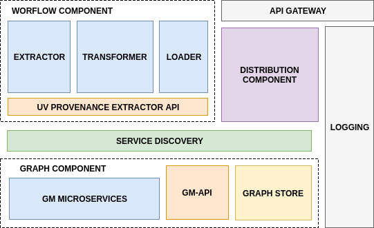
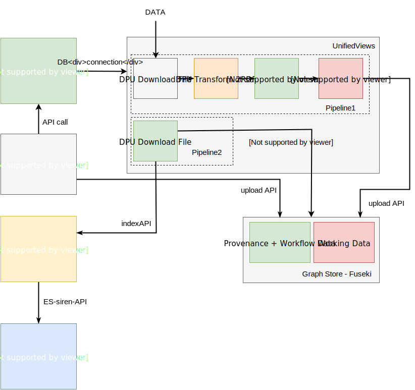
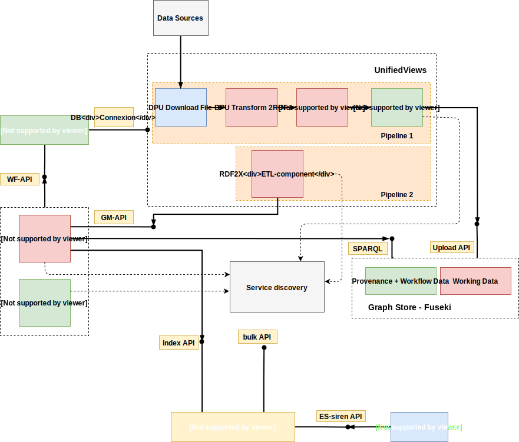

# ATTX Architecture Overview

The following components are part of the ATTX architecture.
* [Workflow Component](#workflow-component)
* [Graph Component](#graph-component)
* [Distribution Component](#distribution-component)
* [Semantic Broker Deployment](#platform-deployment)
* [Service Discovery](#service-discovery)

Figure 1. ATTX Semantic Broker Architecture

There are three main components: **Workflow Component**, **Graph Component**, **Distribution Component** while the **Service Discovery** and the **Semantic Broker Deployment** gather all of them together in order to provide them as a individual services or as a platform.

The communication and contracts between the components is specified in [Inter-component Communication](#inter-component-communication)

## Terminology and Acronyms

Acronyms:
* _WF_ - Workflow Component
* _GC_ - Graph Component
* _DC_ - Distribution Component
* _PD_ - Platform Deployment/Semantic Broker Deployment
* _PD_ - Service Discovery
* _UV_ - UnifiedViews (WF component implementation)
* _ES_ - ElasticSearch (DC component implementation)
* _ETL Artifact_ - any kind of ETL software (e.g. UnifiedViews)
* sometimes a _workflow_ can also be referred to as _pipeline_
* sometimes a _activity_ can also be referred to as _executed job_ or _pipeline execution_
* _artifact_ - any software or application/programming language specific library

## Workflow Component

The ATTX Workflow Component provides a configurable framework with the main purpose of managing, scheduling and monitoring data ingestion, processing and distribution related workflows. Workflow Component provides the Semantic Broker information related to provenance of the working data.

* Github Repository: [workflow-component](https://github.com/ATTX-project/workflow-component)
* Details about the [Workflow Component](Workflow-Component.md).

## Graph Component

The ATTX Graph component associated to this project has the main goal of aggregating the data that flows within the Semantic Broker, types of transformations (and associated workflows), the provenance information (agent and ETL processes performed) and other meta data.

* Github Repository: [graph-component](https://github.com/ATTX-project/graph-component)
* Details about the [Graph Component](Graph-Component.md).

## Distribution Component

This ATTX Distribution Component provides the interface between the Workflow Component and/or Graph Component for public consumption of disseminated data.

* Github Repository: [distribution-component](https://github.com/ATTX-project/distribution-component)
* Details about the [Distribution Component](Distribution-Component.md).

## Semantic Broker Deployment

This ATTX Semantic Broker Deployment describes the necessary steps for setting up the whole ATTX Project or working with individual components.

* Github Repository: [platform-deployment](https://github.com/ATTX-project/platform-deployment)
* Details about the [ATTX Broker Deployment](ATTX-Broker-Deployment.md).

## Service Discovery

There are three stages/versions to the service discovery/inter-component communication:

Figure 2. Stage 1 of Inter-component Communication

* **Stage 1** - represents the base structure for achieving the flow of data between the three main components. At this stage the distinction between the components is rudimentary. For example the Graph Manager consists of a single scheduled script which consumes the WF-API. Components communication with direct HTTP requests using hard-coded component names.

* **Stage 2** - in this stage the major difference is that communication between components is implemented using messaging middleware component such as ActiveMQ. Message recipients are still hard-coded.  

Figure 3. Stage 3 with Service discovery and processing services

* **Stage 3** - in this stage the components take shape such as Pipeline2 functionality is provided by the [Graph Manager Component](Graph-Component,md), and the Graph Manager also provides an API. The [Workflow Component](Workflow-Component.md) instead of being depended on UnifiedViews as an ETL tool moves towards an Workflow tool (e.g. https://nifi.apache.org/ or https://github.com/spotify/luigi or http://www.dswarm.org/ etc. - see [Workflow Management Tools](Workflow-Management-Tools.md) ). Workflows can include steps where implementation is provided by other platform components and workflow step only provides the UI for configuring the service execution. In order manage and use these new service Service Discovery component is needed as one of the core components of the platform.
