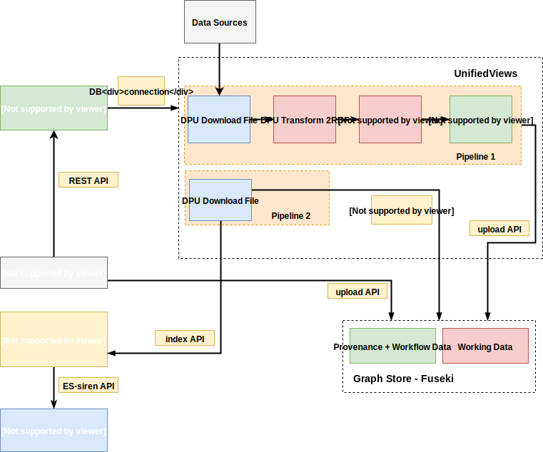

# ATTX Architecture Overview

The following components are part of the ATTX architecture.
* [Workflow Component](#workflow-component)
* [Graph Component](#graph-component)
* [Distribution Component](#distribution-component)
* [Semantic Broker Deployment](#platform-deployment)
* [Message Broker](#message-broker)
* [Service Discovery](#service-discovery)

Figure 1. ATTX Semantic Broker Architecture

ATTX Semantic Broker is composed of a collection of loosely coupled services, which implement several broker-like capabilities. Example of such services are illustrated in: **[Microservices Architecture](#microservices-example)**.

Given that there are a collection of such services, we can still identify three core components under which we can cluster the services: **Workflow Component**, **Graph Component**, **Distribution Component** while the **Service Discovery** and the **Semantic Broker Deployment** gather all of them together in order to provide them as a individual services or as a platform. The communication and contracts between the components is specified in [Message Broker](#message-broker).

## Terminology and Acronyms

Acronyms:
* _WF_ - Workflow Component
* _GC_ - Graph Component
* _DC_ - Distribution Component
* _PD_ - Platform Deployment/Semantic Broker Deployment
* _PD_ - Service Discovery
* _UV_ - UnifiedViews (WF component implementation)
* _ES_ - ElasticSearch (DC component implementation)
* _ETL Artifact_ - any kind of ETL software (e.g. UnifiedViews)
* sometimes a _workflow_ can also be referred to as _pipeline_
* sometimes a _activity_ can also be referred to as _executed job_ or _pipeline execution_
* _artifact_ - any software or application/programming language specific library

## Workflow Component

The ATTX Workflow Component provides a configurable framework with the main purpose of managing, scheduling and monitoring data ingestion, processing and distribution related workflows. Workflow Component provides the Semantic Broker information related to provenance of the working data.

* Details about the [Workflow Component](Workflow-Component.md).

## Graph Component

The ATTX Graph component associated to this project has the main goal of aggregating the data that flows within the Semantic Broker, types of transformations (and associated workflows), the provenance information (agent and ETL processes performed) and other meta data.

* Details about the [Graph Component](Graph-Component.md).

## Distribution Component

This ATTX Distribution Component provides the interface between the Workflow Component and/or Graph Component for public consumption of disseminated data.

* Github Repository: [distribution-component](https://github.com/ATTX-project/distribution-component)
* Details about the [Distribution Component](Distribution-Component.md).

### Semantic Broker Deployment

This ATTX Semantic Broker Deployment describes the necessary steps for setting up the whole ATTX Project or working with individual components.

* Github Repository: [platform-deployment](https://github.com/ATTX-project/platform-deployment)
* Details about the [ATTX Broker Deployment](ATTX-Broker-Deployment.md).

## Service Discovery

Service Discovery is part of the ATTX Semantic Broker core components as it addresses the need to deal with with static and manual configuration of components and at the same time the need to scale up the (micro)services offered by the broker.
More details at:
* [Service Discovery Implementation](ServiceDiscovery-Implementation.md)
* [Service Discovery Solutions Overview](Service-Discovery-Solutions.md)

## Message Broker

There are two versions to the service discovery/inter-component communication illustrated below, both of them can adhere to a message based communication (mostly asynchronous) or REST-API based communication (mostly synchronous) or a combination of both.

Figure 2. Version 1 of Inter-component Communication

* **Version 1** - represents the base structure for achieving the flow of data between the three core components. At this stage the distinction between the components is rudimentary. For example the Graph Manager consists of a single scheduled event that consumes the UVProvovenance API. Components communication with direct HTTP requests using hard-coded component names.

Figure 3. Version 2 with Service discovery and processing services

* **Version 2** - in this stage the components take shape such as Pipeline2 functionality is provided by the [Graph Manager Component](Graph-Component,md), and the Graph Manager also provides an API.

We chose UnifiedViews as a default interface for the [Workflow Component](Workflow-Component.md) however other ETL tools can be considered as long as they provide the necessary framework for extracting provenance(e.g. https://nifi.apache.org/ or https://github.com/spotify/luigi or http://www.dswarm.org/ etc. - see [Workflow Management Tools](Workflow-Management-Tools.md) ).

While the communication between components is implemented using messaging middleware component such as ActiveMQ or RabbitMQ -  see [Message Broker](MessageBroker.md) - the communication between components does not have to be real time.

## Microservices Example

We would like to illustrate how such an architecture would look in practice and some of the services that might be part of it.

In Figure 4 we illustrate a pipeline that downloads a new version of a dataset and replaces the old one. We identified the following services to aid with this process:
* _RMLService_ - converting the downloaded dataset from CSV format to RDF and storing it for access at a specified location;
* _GM-API_ - used for orchestrating access to the Graph Store and generation of provenance information;
* _ProvenanceAPI_ - based on the collected information and a trigger from _GM-API_ this service will generate provenance data and store it to its own Graph Store or send it to _GM-API_ on a request basis;
* _UVProvenanceAPI_ - used for extracting provenance information from UnifiedViews, as not all provenance information can be collected (start and end times of a pipeline/workflow, if a workflow is public or private, or if a pipeline execution is successful) by the DPUs and transmitted to _GM-API_ and implicitly to _ProvenanceAPI_.

Figure 4. Pipeline for downloading and replacing dataset

As a continuation of the result of the pipeline depicted in Figure 4, the pipeline from Figure 5 exhibits the steps necessary for publishing the resulting data. In order to achieve this we identified the following services:
* _ESDistributionService_ - service for constructing, based on the graph retrieved from Graph Store, JSON/JSON-LD formatted bulk data, that is stored on a volume. This microservice can be further divided into two otherservices:
    * _RDFFramerService_ - converting the data from RDF to JSON/JSON-LD;
    * _indexService_ - (bulk) indexing at a specific endpoint;
* _ElasticSearch_ - several versions might be available each providing different indexing mechanisms.

Figure 5. Pipeline for Publishing Dataset

In all the cases presented above the Service Discovery component plays an important role for retrieving and acts as a router for requests - more information available at: [Service Discovery Implementation](ServiceDiscovery-Implementation.md).
