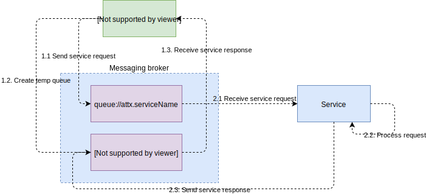
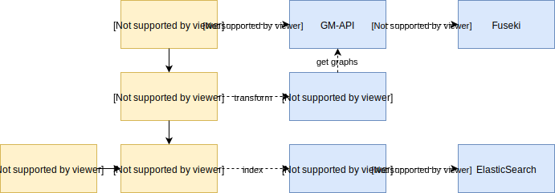

# Asynchronous communication between platform components

Replicating request/async response pattern between workflow steps and ATTX services. In order for the responses to be non blocking while waiting fro them, we recommend implementing under the assumption that the response might not arrive for a while.

Two solutions have been taken into consideration for the Messaging service:
* [ActiveMQ Message Broker](MessageBroker-ActiveMQ.md)
* [RabbitMQ Message Broker](MessageBroker-RabbitMQ.md) - selected

Provenance service should receive all(?) the messages. This can implemented using Camel route that intercept, copies and sends messages to queue://core.provenance.

## Requirements for ATTX services

* For queues, service must listen to a queue named "attx.{servicename}". Are there any reserved topic names?
* Queues starting with "core." are reserved for special cases such as for provenance service.

## How do ATTX service find the MessageBroker?

Implementation alternatives:

* Configure and use [discovery service](http://activemq.apache.org/discovery.html) provided by the ActiveMQ that is based on multicast.
* Have ActiveMQ to register itself to the ATTX Discovery service and query that or use it through a proxy.

## Using topics aka publish/subscribe

What are the use cases for topic based messaging where the same message can have multiple recipients?

## Example: Messaging one's way through basic distribution workflow

This examples shows the steps, services and messages involved in a basic distribution workflow that takes data from from the graphstore, transfers it to JSON and indexes newly created JSON data to a ElasticSearch.

**TODO: Maybe we need to add some messages related to provenance, depending on how it is implemented.**

**Query datasets**
Since the workflow is using data already existing in the platform, we need to be able to query the created datasets and their properties. Step will communicate with the GM-api and directly with the graphstore.

**Transform**
Example step uses [JSON-LD framing](https://json-ld.org/spec/latest/json-ld-framing/) to generate JSON representation of the source graph. In order to do that, it needs to get the graph data from the GM-API.

**Index**
Indexing services organizes ES indices and indexes the output from the Framer service.

**Manage graphs**
GM-api uses Fuseki's API to add, delete and retrieve triples from the graph store.

**Manage indices**
Indexing services uses Elastic's APIs to delete and create indices and to index JSON document either individually or in bulk.

## References:

* [Inter-Process Communication in a Microservices Architecture](https://www.nginx.com/blog/building-microservices-inter-process-communication/)
