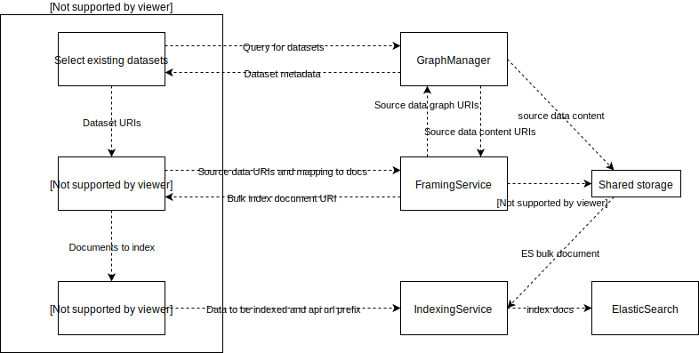

# Dissemination pipelines

Dissemination workflow is used to transform subset of the working data stored as graphs into documents that can be accessed through an API or as a file. This document describes "pure" dissemination graphs, that do not contain any other processing components other than the graph to document transformation.


## Workflow component

Figure 1 Shows the plugins required to build the simplest dissemination pipeline.


In the first step, the user can browse and search dataset in the working data and select appropriate ones as the data sources for the transformation. Next, transformation plugin allows user to apply a mapping that turns input graphs into documents (eg. JSON). Lastly, the publish plugin makes transformed data available through an API.

## Services

Figure 2. Depicts the workflow plugins and services needed to implement the workflow.



Selecting existing dataset is done by querying the GraphManager for provenance data related to the working graphs. Dataset metadata returned by the GM contains title and description of the dataset as well as information about the licenses associated with the dataset(?). Selected dataset URIs are outputted for further processing.

Transformation step takes the dataset URIs as an input and sends them and the configured/generated mapping tot the FramingService. FramingService first uses the GraphManager to get access the actual content of the designated input datasets and then executes JSON-LD framing against a graph that merges triples from all the input datasets. FramingService outputs JSON using ElasticSearch's Bulk format. Bulk action defaults to "index" and the id of each document is parsed from the root resources of a resulting frame.

Example bulk document
```
{ "index" : {  "_type" : "publication", "_id" : "http://example.org/pub1" } }
{"@id": "http://example.org/pub1","@type": "http://example.org/vocab#Publication","http://purl.org/dc/elements/1.1/creator": "Plato","http://purl.org/dc/elements/1.1/title": "The Republic"}    
```

User can also give the document type as parameter. If document type is not given, the service will first try to parse the type using the value of `@type` property from the document. If that is not available, a static type "General" is used. Resulting ES bulk document is stored on the shared file system and the URI pointing to that document is sent back as a reply.

Indexing service receives the URI of the bulk file and the alias under which to index the documents. It first creates a new index under a generated name using the bulk file. If the indexing completes successfully, the service then removes the alias from the existing index (if any), adds it to the new index and deletes the old index.
