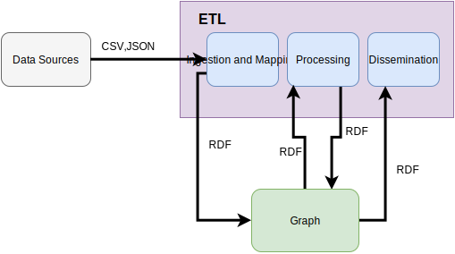
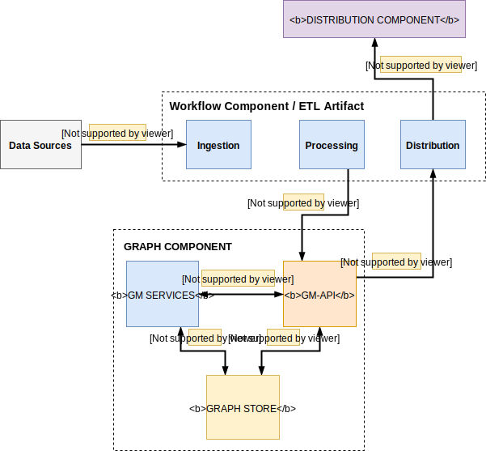

## ETL Artifacts

The Workflow Component ETL artifact consists of three core components as depicted in Figure 1:

* Ingestion and Mapping
* Processing
* Dissemination

Other ETL components could be added to the ETL stack with the purpose of enhancing the results. Examples include:

* NER for extracting Places, Organization etc.
* Data converters

Figure 1. ETL Data Workflow

---

Some of the uses of the ETL workflow include: inferencing, updating Public APIs, Transformation, updating ElasticSearch via the Graph (GM - Graph Manager component). Graph Manager component also can provide input to the ETL components further enriching the information contained in the platform.

A draft overview on the Semantic Broker components is provided in Figure 2.

Figure 2. ETL Platform Component Workflow

## Comparison of ETL Artifacts

The table below shows a basic comparison of some of the ETL tools and required functionalities with relation to the ATTX project.

| Tool | Workflows | Activities | REST API | Plugins | UI | License |
| --- | :---: | :---: | :---: | :---: | :---: | :---: |
| [Wings](https://github.com/IKCAP/wings) | Yes | Yes ? | No ? | No ? | Yes | Apache 2.0 |
| [LinkedPipes](https://github.com/linkedpipes/etl) | Yes | Yes | Yes | Yes ? | Yes | MIT |
| [DSwarm](http://www.dswarm.org/) | ? Maybe Transformations | ? Maybe Transformations | Yes | No ? | Yes | Apache 2.0 |
| [Web-Karma](https://github.com/usc-isi-i2/Web-Karma) | No, although there is Batch Mode | No, although there is Batch Mode | Yes | Yes, kinda | Yes | Apache 2.0 |
| [UnifiedViews](https://github.com/UnifiedViews/Core) | Yes | Yes | Yes \(Limited\) | Yes | Yes | GPL 3.0 |
| [FluidOps](http://www.fluidops.com/) | ? | ? | ? | Yes ? | Yes | Commercial |
| [Silk Framework](http://silkframework.org) | Yes, Tasks | Yes, Workspace | Yes | Yes | Yes | Apache 2.0 |
| [Pentaho](http://community.pentaho.com/projects/data-integration/) | Maybe ? via Jobs | Maybe ? via Jobs | No ? | Yes | Yes | Apache 2.0 |

## References

* [https://www.opensemanticsearch.org/etl](https://www.opensemanticsearch.org/etl)
* [https://github.com/pawl/awesome-etl\#python](https://github.com/pawl/awesome-etl#python)
