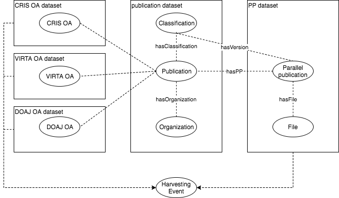

# <span style="color:red">DRAFT - work in progress</span>

# Use case Jyväskylä - Parallel Publishing Dashboard

Parallel publication (rinnakkaistallennus in Finnish) is a version of the published research article that is freely available from the organizations digital repository or similar service. For more detailed description about parallel publishing and how it relates to OA in general see https://www.jyu.fi/tutkimus/rinnakkaisjulkaiseminen/en/open-access/parallel-publishing (Jyväskylä university).

The idea behind parallel publishing dashboard is to create a up-to-date data set and accompanying web application, which together allow users to browse and visualize current state of parallel publishing in Finland along different attributes, such as organization, field of science or any other custom classification scheme. Data set and application should be flexible and support multiple "views" against the same data.

University of Jyväskylä library has been doing similar work and results were presented by Pekka Olsbo as part of closing seminar for the Surima-project. His presentation slides can be downloaded from http://urn.fi/URN:NBN:fi-fe201701251319.

Our goal, as part of the ATTX project, is to build and setup working prototype of a data broker that could be used to drive a national open data service, but putting one in production is out of the scope of the project.

One could argue that [VIRTA](https://confluence.csc.fi/display/VIR/VIRTA-julkaisutietopalvelu) service already contains the same information and works on a national level with excellent coverage. However, ATTX use case can be seen as complementary to the VIRTA data set, because it provides a platform for new data aggregation and generation methods (e.g. data mining from parallel published versions, licensing permitting) and allows for alternative "views" on parallel publishing (e.g. grouping based on custom classification).  

Also, VIRTA is the official publication data set with strict requirements for completeness and quality, where as the data set created in this use case has less stringent expectations for incoming data and is therefore not designed to work as a basis for any official reporting.

## Approach

In order to able to work with percentages, we need metadata data for every publication and well as the parallel published subset of publications. The the approach is to use combination of harvested (VIRTA) and master (CRIS) data sources in order to create the data set for all publications. We will then to use different kind of repositories, institutional, national and subject based, to get metadata data about the parallel published versions and associated files. Simple linking between these two data sets is done using the existing identifiers, such as DOIs and URNs.

Use can be later be expanded to include other more complicated properties related to open access in general.

## User stories

* As an admin, I want to create the initial data data from one of the publication metadata sources.

* As an admin, I want to setup incremental harvesting of updates to the already existing data set, which should contain only changes made after the latest successful harvesting.

* As an admin, I want to add new properties to the existing data publication metadata data set.

* As an admin, I want add new vocabulary for classifying resources in the existing data set. Classification is based on the existing publication metadata i.e. it is created by linking set existing metadata values e.g. field of science to new concept.

* As an admin, I want to make sure that the vocabulary data is updated every month

* As an admin, I want to create a link from publication to the new vocabulary

* As an admin, I want to publish publication metadata so that is can be queried using the new vocabulary

* As an interested anonymous user, I want to be able to see the current parallel publishing situation

* As a user, I want be able to group data set according different vocabulary, e.g. field of science, organization or year.

* As a user, I want to see how the parallel publishing situation has evolved between years X and Y given group Z.
For example, percentage of parallel published articles between 2015-2017 in the field of physics.

* As a user, I want to compare the parallel publishing status of publications published in 2015 using data from 2015, 2016 and 2017.

* As a user, I want to download the full data dump of the broker in CSV format.

## Data sources

The use case is built upon publication and file metadata.

### VIRTA

National publication metadata registry with excellent coverage and regularly updated content would be a very good data source for base line publication metadata.

[Documentation](https://confluence.csc.fi/pages/viewpage.action?pageId=65922061) about the data harvested by VIRTA.

2017 harvested data includes link to the parallel published version, but this information is missing from 2015 model and less strict in 2016, so there is room for ATTX type of broker to fill in the blanks. Also, VIRTA data model does not include any information about the version (preprint, post-print...) of parallel published version, which is something that could be included in our use case.

Using VIRTA data might not be possible due to the restrictions related to the re-use.

### CRIS systems

Universities' [CRIS systems](https://en.wikipedia.org/wiki/Current_research_information_system) are usually the master sources for publication related data. If there is a need for data that is not part of the VIRTA harvested data, it should be possible to get from the CRIS system. CRIS harvesting might also be beneficial for organizations that still submitting their data to VIRTA only once(?) a year, but are still able to make more recent data available for access.

### Repositories

Institutional repositories are our main source of parallel publication data. Repositories provide direct links to the parallel published versions as well as metadata about the available versions (pre-preprint/postprint...). Therefore, on this use case, repositories are considered as data sources for files and file related metadata.

## Required broker features

**History data available**

One should be able to use time related restrictions when querying OA related information. For example, for publications published in 2015, the number of parallel published versions can be different when queried against OA data from 2016 and 2017.

**Incremental harvesting**

Incremental harvested through OAI-PMH protocol makes the data gathering operations more flexible and less time consuming, as the broker only needs to operate on the data modified during certain time period.

*TODO: How is incremental harvesting related to the history data?*

**Configurable CSV to RDF transformation**

Some of the data will be available as CSV files, which must be converted to internal RDF data.

**Configurable XML to RDF tranformation**

Some of the data will be available as XML, which must be converted to internal RDF data.

**Publishing data set as a CSV file**

Internal datasets must be published as CSV file for custom analytics and backup purposes.

**Publishing data set as queryable REST API**

Proof-of-concept javascript based UI uses REST API to access the required data.

**Identifier based linking**

In the first phase, all the linking is done via existing identifiers in the source data.

**Generating new data based on ontologies/rules**

Use must be able to add their custom hierarcical classification schemes to the system by linking them either directly to publications or any related harvested metadata, such as existing classifications. Transitive properties can be used to generated direct link between publications and the data. For example:

Before (asserted data):

```
pub1 -- field of science --> field1

field1 -- related --> customThing1
```
After applying ontology/rule based inferencing:

```
pub1 -- customClassification --> customThing1
```


## Implementation

**Our definition of parallel published publication**

*Add definition here!*

Differentiate between publications in OA journals and parallel published versions of publications.  


### Target data model

First draft:



Basic idea: Publication dataset is connected through harvesting evetns with other versioned datasets that contain OA related information.

**TODO**
* How are the resource (Publication/File) URIs generated?

### University of Jyväskylä

**All publications**

?

**Parallel published**  

Data source: JYX (https://jyx.jyu.fi)

Harvesting interface: OAI-PMH

Fields:

* dc.identifier.other
 * contains internal TUTKA ids (eg. TUTKAID_xxxx)
* dc.description.version
 * Eg. 'Publisher's PDF'
* dc.identifier.urn
 * identifier of the parallel published version. Eg. 'URN:NBN:fi:jyu-xxxxxxx'


### University of Helsinki

**All publications**

Data source: PURE

Harvesting can be implemented using OAI-PMH, PURE's REST api, CSV exports or custom data extraction methods.  

**Parallel published**  

Data source: Helda (https://helda.helsinki.fi/)

Harvesting interface: OAI-PMH

Fields:
* dc.identifier.other
 * Contains both internal and external identifiers from TUHAT. Eg 'PURE: xxxxx' and 'PURE UUID: xxxx'.
* dc.identifier.uri
 * identifier of the parallel published version. Eg. 'http://hdl.handle.net/10138/xxxxx'
* dc.type.uri
 * describes the version of the published file eg. 'info:eu-repo/semantics/publishedVersion'.

### University of Eastern Finland

**All publications**

?

**Parallel published**  

Data source: UEF ERepository (https://erepo.uef.fi/)

Harvesting interface: OAI-PMH

Fields:
* dc.identifier.uri
 * identifier of the parallel published version
* uef.solecris.id
 * Publication's ID in the CRIS system
* dc.description.version
 * Eg. 'Post-print'
