# Thinkopen/Mildred use case

The goal of the use case is to create a dataset that provides an aggregated view to the research data output of the University of Helsinki. This new dataset and accompanied data API are then used as the back-end service for university's [Think Open](https://www.helsinki.fi/en/research/think-open) site. Think Open brings together and promotes openness-related activities, such as open research data, open source code and publications, within the University of Helsinki.

Use case is part of the [Mildred project](http://blogs.helsinki.fi/mildred/), which aims to update the research data infrastructure provided by the University of Helsinki. Mildred consists of five sub-projects that concentrate on different phases of the research process. ATTX co-operates with the sub-project which is responsible for building and data publishing and metadata services.

### Table of Contents
<!-- TOC START min:1 max:3 link:true update:false -->
  - [Approach](#approach)
  - [User stories](#user-stories)
  - [Data sources](#data-sources)
    - [Etsin](#etsin)
    - [B2Share](#b2share)
    - [Zenodo](#zenodo)
    - [Finto](#finto)
    - [IOW](#iow)
  - [Implementation](#implementation)

<!-- TOC END -->

## Approach

Dataset related metadata is still relatively sparse, compared to other research outputs, such as publications. In this use case we are concentrating solely on data sources that were chosen by the project Mildred's steering group.

One of the main ideas behind the use case, is the added value that ATTX broker deliver by running customizable validation and data quality processes over the harvested data. This additional data can also be published and used by the Think Open site to deliver custom quality metrics alongside the dataset metadata.

Etsin is already a service that aggregates dataset metadata from different sources, so why make another similar dataset? Mildred use case is interested specifically in UH's research outputs whereas Etsin is a national service. By creating an UH specific dataset, we have control over both the content and structure of the dataset, which makes it easier to integrate it with Think Open work or any other UH specific use. It is also possible that some day the data might flow in an opposite direction between UH's dataset and Etsin.

When it comes to identifying which datasets are somehow related to the University of Helsinki, we will start with the simple methods that should have good precision but might not have acceptable recall, in order to get **some** data. It is however possible to extend to those methods with more complex internal processing.

Use case is also featured as part of the OpenScienceFair 2017 in the poster session. ([poster proposal](https://attx-project.github.io/OSFair-2017.html))

## User stories

## Data sources

### Etsin

Etsin is a national research dataset registry that contains both via manually input and harvested metadata.
Based on CKAN.

#### APIs

* Documentation: http://openscience.fi/etsin-api
* Data model: http://openscience.fi/etsin-data-model
* CKAN documentation: http://docs.ckan.org/en/ckan-2.7.0/api/#get-able-api-functions

**REST**


https://etsin.avointiede.fi/api/3


**OAI-PMH**

https://etsin.avointiede.fi/oai?verb=Identify


#### Usage

Every record in Etsin has an owner_org property, which connects it to the owning organization. Organizations (https://etsin.avointiede.fi/api/3/action/organization_list) form a hierarchy (https://etsin.avointiede.fi/organization).

**TODO: Is it possible to utilize the organizational hierarchy with the search API?**

Request https://etsin.avointiede.fi/api/3/action/package_search?&q=owner_org:01901 only return 10 hits that are explicitly connected with UH and not the 7000+ other records that are owned by UH related organizational units.

Getting all the UH related datasets using REST API can be implemented by first constructing a list/graph of UH and related organizations and then querying all of them. More detailed information about an organization can be found from /organization_show endpoint. For example: https://etsin.avointiede.fi/api/3/action/organization_show?id=35367e6f-6cd3-40e4-b2fe-aa391d34eeef, where value of the id parameter can be either name or id of the organization. "groups" property of the returned document contains information about the parent groups, which can be used to create a graph that represents the organizational hierarchy. After harvesting the child->parent relationships, inverse links can be added using simple ontology processing.


When using OAI-PMH interface, owner organization is only references in the header part of the record. For example:
https://etsin.avointiede.fi/oai?verb=GetRecord&identifier=urn:nbn:fi:csc-kata20170611202023598902&metadataPrefix=oai_dc

*Game plan 1*

* Harvest all organizational data and create org_unit -> parent_org_unit relationships ()
* Use ontology to infer inverse relationships
* Create a dataset of UH related Etsin organizations / Query for all UH related organizations.
* Use harvesting API to get the updated records for every UH organization


**Datasets and pipelines**

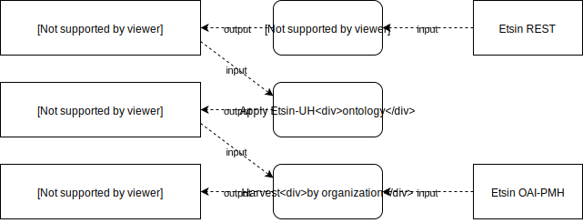

**RML Mappings**

Etsin organizations to internal model.


```turtle
@prefix rr: <http://www.w3.org/ns/r2rml#>.
@prefix rml: <http://semweb.mmlab.be/ns/rml#>.
@prefix ql: <http://semweb.mmlab.be/ns/ql#>.
@prefix ex: <http://example.com/ns#>.
@prefix xsd: <http://www.w3.org/2001/XMLSchema#>.
@prefix rdfs: <http://www.w3.org/2000/01/rdf-schema#>.
@prefix attx: <http://data.hulib.helsinki.fi/attx/> .
@prefix attx-work: <http://data.hulib.helsinki.fi/attx/work#> .
@prefix dct: <http://purl.org/dc/terms/> .
@prefix etsin: <http://etsin.avointiede.fi/> .


<etsin:orgs>
  rml:logicalSource [
    rml:source "https://etsin.avointiede.fi/api/3/action/organization_list?include_groups=True&all_fields=true&limit=10"  ;
    rml:referenceFormulation ql:JSONPath ;
    rml:iterator "$.result[*]"
  ];


  rr:subjectMap [
    rr:template "etsin-org:{name}" ;
    rr:class attx-work:Organization ;
  ];

  rr:predicateObjectMap [
      rr:predicate dct:title;
      rr:objectMap [
        rml:reference "title"
      ]
    ];

  rr:predicateObjectMap [
      rr:predicate dct:description;
      rr:objectMap [
        rml:reference "description"
      ]
    ];

  rr:predicateObjectMap [
      rr:predicate dct:identifier;
      rr:objectMap [
        rml:reference "id" ;
      ]
    ];

  rr:predicateObjectMap [
      rr:predicate attx-work:setName;
      rr:objectMap [
        rml:reference "name" ;
      ]
    ];    

  rr:predicateObjectMap [
      rr:predicate attx-work:parentOrg;
      rr:objectMap [
        rr:template "etsin-org:{groups[*].name}" ;
      ]
    ];
  .
```

Result sample

```rdf
<etsin-org:02469-1054-karelia-1054-rehtorin-toimisto> a <http://data.hulib.helsinki.fi/attx/work#Organization> ;
	<http://purl.org/dc/terms/title> "1054 Rehtorin toimisto" ;
	<http://purl.org/dc/terms/identifier> "02469-1054" ;
	<http://data.hulib.helsinki.fi/attx/work#parentOrg> <etsin-org:02469-karelia> ;
	<http://data.hulib.helsinki.fi/attx/work#name> "02469-1054-karelia-1054-rehtorin-toimisto" .

```

Harvesting interface

Source data with oai_dc metadata prefix.

```turtle
@prefix rr: <http://www.w3.org/ns/r2rml#>.
@prefix rml: <http://semweb.mmlab.be/ns/rml#>.
@prefix ql: <http://semweb.mmlab.be/ns/ql#>.
@prefix ex: <http://example.com/ns#>.
@prefix xsd: <http://www.w3.org/2001/XMLSchema#>.
@prefix rdfs: <http://www.w3.org/2000/01/rdf-schema#>.
@prefix attx: <http://data.hulib.helsinki.fi/attx/> .
@prefix attx-work: <http://data.hulib.helsinki.fi/attx/work#> .
@prefix dct: <http://purl.org/dc/terms/> .
@prefix etsin: <http://etsin.avointiede.fi/> .
@prefix etsin-ds: <http://etsin.avointiede.fi/dataset/> .
@prefix oai: <http://www.openarchives.org/OAI/2.0/> .

<etsin:datasets>
  rml:logicalSource [
    rml:source "https://etsin.avointiede.fi/oai?verb=ListRecords&set=01901-helsingin-yliopisto&metadataPrefix=oai_dc"  ;
    rml:referenceFormulation ql:XPath ;
    rml:iterator "/*[local-name()='OAI-PMH']/*[local-name()='ListRecords']/*[local-name()='record']"
  ];


  rr:subjectMap [
    rr:template "http://urn.fi/{*[local-name()='header']/*[local-name()='identifier']}" ;
    rr:class attx-work:Dataset ;
  ];

  rr:predicateObjectMap [
      rr:predicate dct:title;
      rr:objectMap [
        rml:reference "*[local-name()='metadata']/*[local-name()='dc']/*[local-name()='title']"
      ]
    ];

  rr:predicateObjectMap [
      rr:predicate attx-work:owner;
      rr:objectMap [
        rr:template "etsin-org:{*[local-name()='header']/*[local-name()='setSpec']}"
      ]
    ];    
.
```

Results

```rdf
<http://urn.fi/urn%3Anbn%3Afi%3Acsc-kata20161121150636648833> a <http://data.hulib.helsinki.fi/attx/work#Dataset> ;
	<http://purl.org/dc/terms/title> "DMPTuuli user survey raw data 2016" ;
	<http://data.hulib.helsinki.fi/attx/work#owner> <etsin-org:01901-helsingin-yliopisto> .

```

### B2Share

[B2Share](https://b2share.eudat.eu/) is part of the [EUDAT](https://eudat.eu/) collaborative data infrastructure.

In B2Share the data is organized around communities, all of which maintain their own metadata schemas for community related records. This means that harvested data structures can vary depending on which community the record belongs to. There is also a common schema that is shared with all the communities.

Based on Invenio

#### APIs

https://b2share.eudat.eu/api/

Documentation

* https://b2share.eudat.eu/help/api
* https://www.eudat.eu/services/userdoc/the-b2share-http-rest-api

Elastic based data structure.
B2Share also has OAI-PMH interface, but it seems that it has not been exposed yet.

#### Usage

There is no UH community, although Aalto has one, but UH related dataset are distributed amongst the research infrastructure and field specific communities. Affiliation related information is in the publisher and description fields.

Communities:

https://b2share.eudat.eu/api/communities/

Records by community:

https://b2share.eudat.eu/api/records/?q=community:867c4e67-9227-4b6f-8595-c97d37e9de61


### Zenodo

[Zenodo](https://zenodo.org) is a general purpose repository for all kinds of research outputs ranging from presentations to datasets. Users can create communities to organize content into subrepositories.

Based on Invenio

#### API

Documentation:
http://developers.zenodo.org/

**REST (beta - no full documentation yet 08-2017)**

https://zenodo.org/api

Zenodo REST API most likely uses Elastic as their implementations, because the output format is identical to one returned by Elastic's aggregation queries.

**OAI-PMH**

https://zenodo.org/oai2d

**Output formats**
* DataCite
* DataCite3.

Both have OAI specific variants available, which encapsulate the same record content with OAI elements. These representations include fields such as <isReferenceQuality> and other additional (to DataCite format) info. oai_datacite is the recommended metadata format.
Example output from Hulib community in DataCite format:
https://zenodo.org/oai2d?verb=ListRecords&metadataPrefix=oai_datacite&set=user-hulib

http://developers.zenodo.org/#metadata-formats


#### Usage

Affiliations can be used to identify creators that are from UH. However, there are different variations:

```
<creator>
  <creatorName>X, Y</creatorName>
  <affiliation>Helsinki University Library</affiliation>
</creator>

<creator>
  <creatorName>X, Y, Helsinki University Library</creatorName>
</creator>

<creator>
  <creatorName>Helsinki University Library</creatorName>
</creator>
```

Output from OAI-PMH interface does not include links to the file metadata (links.bucket). OAI-PMH also has license information in URI format.

```json
"license": {
    "id": "CC-BY-4.0"
}
```

compared to

```xml
<rightsList>
  <rights rightsURI="https://creativecommons.org/licenses/by/4.0/" >Creative Commons Attribution 4.0</rights>
  <rights rightsURI="info:eu-repo/semantics/openAccess" >Open Access</rights>
</rightsList>
```

Harvesting is available using OAI-PMH protocol. Harvesting can be targeted using sets that correspond to communities. For example https://zenodo.org/oai2d?verb=ListRecords&set=user-hulib&metadataPrefix=oai_dc would return records published by the University of Helsinki library.

**TODO: What are the other UH related Zenodo communities?**

We can create another dataset that links communities to UH and use that to make the first broad classification of records.

*Game plan*

Since UH related data is distributed amongst different communities (i.e. there is no "UH" community), we can't limit our harvesting to any subset of communities, but we have go through all of them. We can either use the REST api to filter records via queries (e.g. publisher contains "helsinki") or first harvest all the records via OAI-PMH and do the filtering using internal processing. The best approach might be to use both.

* Identify communities, which are directly related to UH, and harvest their data using OAI-PMH interface. -> zenodo-uh-communities-ds
* Query all the other communities for potentially UH related data -> zenodo-uh-base-ds
* Process zenodo-uh-related-ds internally to filter actually UH related data -> zenodo-uh-filtered-ds


**Datasets and pipelines**

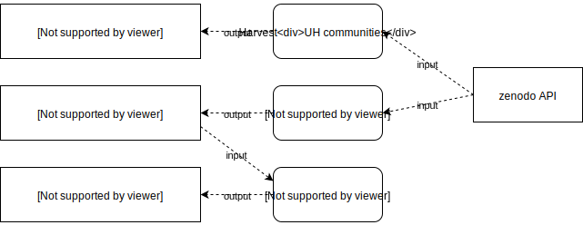


**RML Mappings**

Community's datasets via OAI-PMH:

```
<etsin:datasets>
  rml:logicalSource [
    rml:source "https://zenodo.org/oai2d?verb=ListRecords&metadataPrefix=oai_datacite&set=user-hulib" ;    
    rml:referenceFormulation ql:XPath ;
    rml:iterator "/*[local-name()='OAI-PMH']/*[local-name()='ListRecords']/*[local-name()='record']/*[local-name()='metadata']/*[local-name()='oai_datacite']"
  ];


  rr:subjectMap [
    rr:template "http://doi.org/{*[local-name()='payload']/*[local-name()='resource']/*[local-name()='identifier']}" ;
    rr:class attx-work:Dataset ;
  ];

  rr:predicateObjectMap [
      rr:predicate dct:title;
      rr:objectMap [
        rml:reference "*[local-name()='payload']/*[local-name()='resource']/*[local-name()='titles']/*[local-name()='title']"
      ]
    ];
.

```

Result:

```rdf
<http://doi.org/10.5281%2Fzenodo.10857> a <http://data.hulib.helsinki.fi/attx/work#Dataset> ;
	<http://purl.org/dc/terms/title> "Research Goes On: Post-Observatory Astronomy Resources In Helsinki" .
```

Simple search through REST API:

```turtle
@prefix rr: <http://www.w3.org/ns/r2rml#>.
@prefix rml: <http://semweb.mmlab.be/ns/rml#>.
@prefix ql: <http://semweb.mmlab.be/ns/ql#>.
@prefix ex: <http://example.com/ns#>.
@prefix xsd: <http://www.w3.org/2001/XMLSchema#>.
@prefix rdfs: <http://www.w3.org/2000/01/rdf-schema#>.
@prefix attx: <http://data.hulib.helsinki.fi/attx/> .
@prefix attx-work: <http://data.hulib.helsinki.fi/attx/work#> .
@prefix dct: <http://purl.org/dc/terms/> .
@prefix etsin: <http://etsin.avointiede.fi/> .


<etsin:orgs>
  rml:logicalSource [
    rml:source "https://zenodo.org/api/records/?q=helsinki"  ;
    rml:referenceFormulation ql:JSONPath ;
    rml:iterator "$.hits.hits[*]"
  ];


  rr:subjectMap [
    rr:template "http://doi.org/{doi}" ;
    rr:class attx-work:Dataset ;
  ];

  rr:predicateObjectMap [
      rr:predicate dct:title;
      rr:objectMap [
        rml:reference "metadata.title"
      ]
    ];

  rr:predicateObjectMap [
      rr:predicate dct:description;
      rr:objectMap [
        rml:reference "metadata.description"
      ]
    ];

  rr:predicateObjectMap [
      rr:predicate dct:identifier;
      rr:objectMap [
        rml:reference "id" ;
      ]
    ];

  rr:predicateObjectMap [
      rr:predicate attx-work:setName;
      rr:objectMap [
        rml:reference "communities[*].id" ;
      ]
    ];

  rr:predicateObjectMap [
      rr:predicate attx-work:isSupplementTo;
      rr:objectMap [
        rr:template "http://doi.org/{metadata.related_identifiers[?(@.relation=='isSupplementTo')].identifier}" ;
      ]
    ];    
.
```

Results:

```rdf
<http://doi.org/10.5281%2Fzenodo.30823> a <http://data.hulib.helsinki.fi/attx/work#Dataset> ;
	<http://purl.org/dc/terms/title> "Information Practices of Clinical Researchers - New Services in New Time" ;
	<http://purl.org/dc/terms/identifier> "30823" ;
	<http://data.hulib.helsinki.fi/attx/work#setName> "hulib" ;
	<http://purl.org/dc/terms/description> "test" .

<http://doi.org/10.3897%2Fnatureconservation.8.6369.suppl3> a <http://data.hulib.helsinki.fi/attx/work#Dataset> ;
	<http://purl.org/dc/terms/title> "test title 2" ;
	<http://purl.org/dc/terms/identifier> "855230" ;
	<http://purl.org/dc/terms/description> "Figure S2: Explanation note: The studied sites in August 2003: a) Top b) Grove c) Middle d) North." ;
	<http://data.hulib.helsinki.fi/attx/work#isSupplementTo> <http://doi.org/10.3897%2Fnatureconservation.8.6369> .

```

### Finto

[Finto](http://finto.fi/en/) or Finnish thesaurus and ontology service can be used to access up-to-date versions of maintained linked vocabularies, which can be used to describe datasets or linked to existing dataset description to provide linked data for complex queries and automatic inferencing of new data.

### IOW

[IOW](https://iow.csc.fi/) is a service for creating and maintaining descriptions for interoperability. In the context of this use case, it means that IOW can be used as the data source for schemas that allow for automatic validation of incoming or outgoing broker data.

### Google Drive

Google Drive provides an easy way to incorporate manually curated lists of UH datasets to ATTX workflows. One can create a link from a spreadsheet file that allows ATTX to download it in a CSV format. The CSV data can then be processed in to RDF and used as one of the filtering datasets as part of the publishing pipeline. 

Creating CSV link for a Google Drive spreadsheet:
* select "File"->"Publish to the web..."
* From the link tab select the appropriate sheet and comma-separeated values as the output format
* Click "Publish" and use the generated link in the pipeline's HTTP extractor

Example CSV:
```
DOI
10.123/TEST.123
```

Example RML:

```turtle
@prefix rr: <http://www.w3.org/ns/r2rml#>.
@prefix rml: <http://semweb.mmlab.be/ns/rml#>.
@prefix ql: <http://semweb.mmlab.be/ns/ql#>.
@prefix ex: <http://example.com/ns#>.
@prefix xsd: <http://www.w3.org/2001/XMLSchema#>.
@prefix rdfs: <http://www.w3.org/2000/01/rdf-schema#>.
@prefix attx: <http://data.hulib.helsinki.fi/attx/> .
@prefix attx-work: <http://data.hulib.helsinki.fi/attx/work#> .

<:handpicked>
  rml:logicalSource [
    rml:source "{filename}";
    rml:referenceFormulation ql:CSV
  ];
  
  rr:subjectMap [
    rr:template "doi:{DOI};
    rr:class attx-work:uh-dataset
  ];

```

## Implementation

Architectural overview:

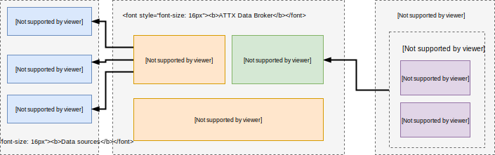

### Pipelines

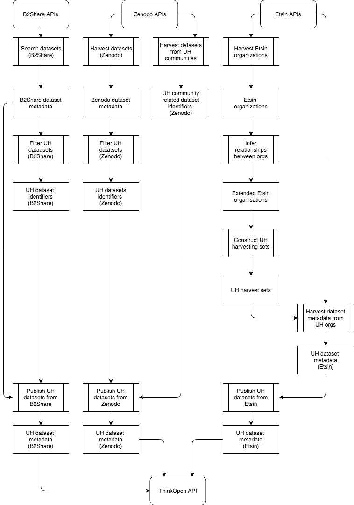

From the figure above we can deduce the following dependencies between pipelines:

* Search datasets (B2Share) -> Filter UH datasets (B2Share) -> Publish UH datasets from B2Share 
* Harvest datasets (Zenodo) -> Filter UH datasets (Zenodo) && UH community related dataset identifiers 
(Zenodo) -> Publish UH datasets from Zenodo 
* Harvest Etsin organizations -> Infer relationships between orgs -> Construct UH harvesting sets -> Harvest dataset metadata from UH orgs -> Publish UH datasets from Etsin

These dependencies should be taken in account when setting up rules for pipeline execution in UnifiedViews.

Pipelines can be found in the use-case repository.

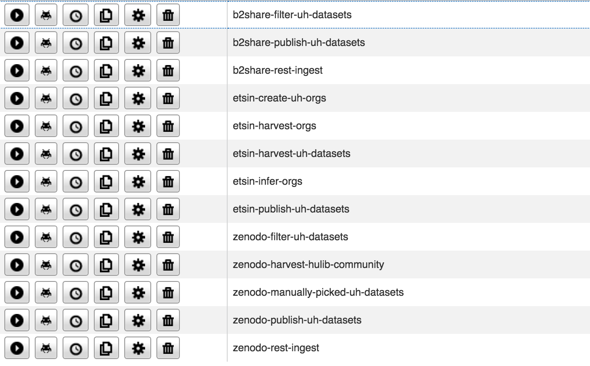

#### Pipeline examples

**Harvest Etsin organizations**

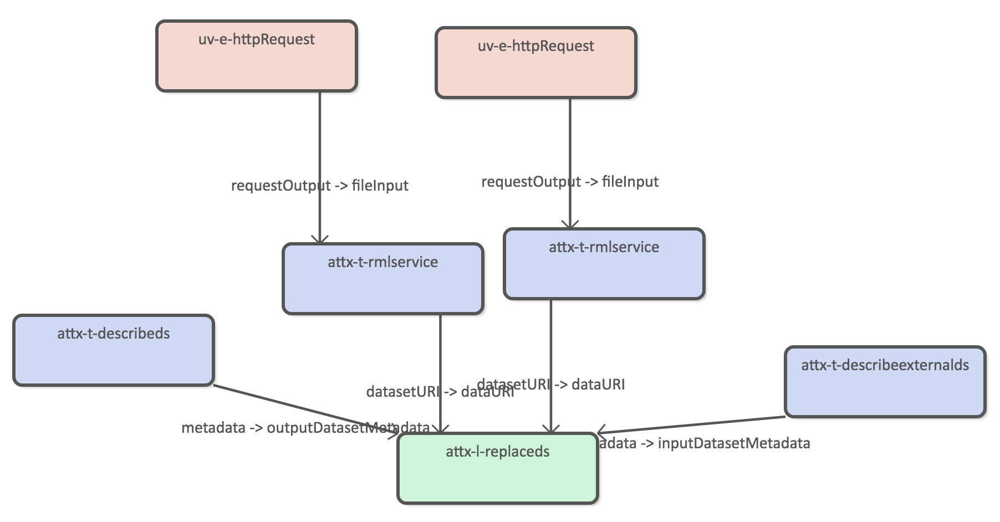

The pipeline uses two different httprequets extractors to split the data download.

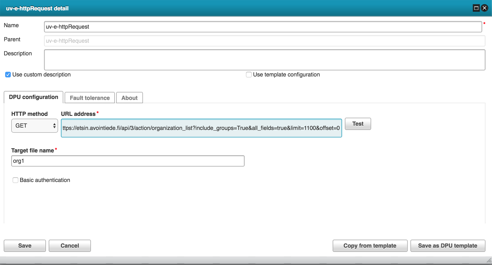

The following RML configuration is used to transform organization json to internal RDF.

```turtle
@prefix rr: <http://www.w3.org/ns/r2rml#>.
@prefix rml: <http://semweb.mmlab.be/ns/rml#>.
@prefix ql: <http://semweb.mmlab.be/ns/ql#>.
@prefix ex: <http://example.com/ns#>.
@prefix xsd: <http://www.w3.org/2001/XMLSchema#>.
@prefix rdfs: <http://www.w3.org/2000/01/rdf-schema#>.
@prefix attx: <http://data.hulib.helsinki.fi/attx/> .
@prefix attx-work: <http://data.hulib.helsinki.fi/attx/work#> .
@prefix dct: <http://purl.org/dc/terms/> .
@prefix etsin: <http://etsin.avointiede.fi/> .


<etsin:orgs>
  rml:logicalSource [
    rml:source "{filename}"  ;
    rml:referenceFormulation ql:JSONPath ;
    rml:iterator "$.result[*]"
  ];


  rr:subjectMap [
    rr:template "http://etsin.avointiede.fi/org/{name}" ;
    rr:class attx-work:Organization ;
  ];

  rr:predicateObjectMap [
      rr:predicate dct:title;
      rr:objectMap [
        rml:reference "title"
      ]
    ];

  rr:predicateObjectMap [
      rr:predicate dct:description;
      rr:objectMap [
        rml:reference "description"
      ]
    ];

  rr:predicateObjectMap [
      rr:predicate dct:identifier;
      rr:objectMap [
        rml:reference "id" ;
      ]
    ];

  rr:predicateObjectMap [
      rr:predicate attx-work:setName;
      rr:objectMap [
        rml:reference "name" ;
      ]
    ];    

  rr:predicateObjectMap [
      rr:predicate attx-work:parentOrg;
      rr:objectMap [
        rr:template "http://etsin.avointiede.fi/org/{groups[*].name}" ;
      ]
    ];
  .
```

**Infer organizations**

The original organization data only includes links to parent organizational unit. 

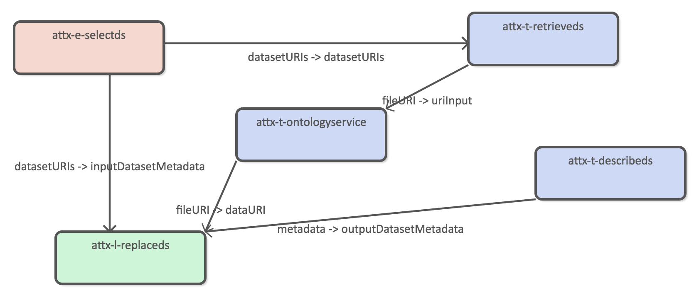

Using harvested organization data as the source dataset.

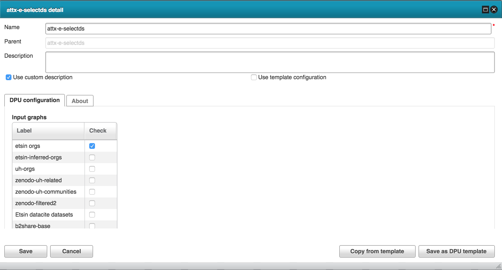

The new data we want to infer is the inverse childOrg property. We also want to make it transitive in order to create a direct link between the root organization (UH) and all of its child organizational units. 

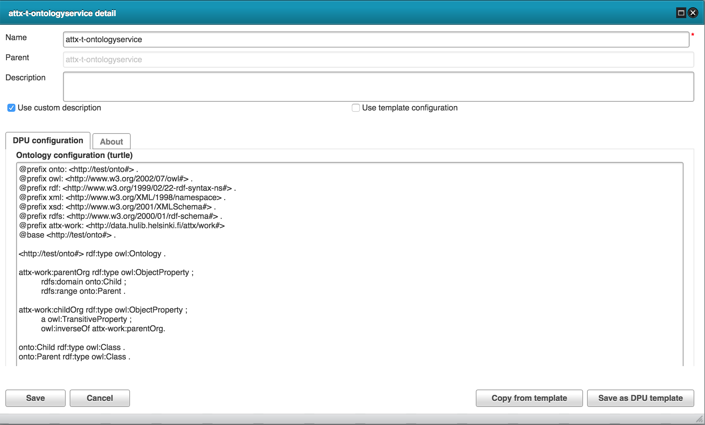

**Create UH orgs***

We need to create dataset that can be used as the source data for set based OAI-PMH harvesting.

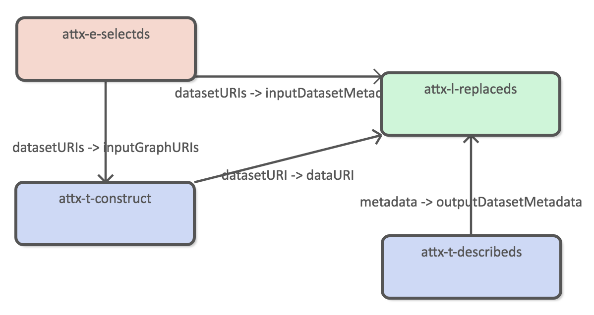

Using both harvested and inferred organization dataas the source datasets.

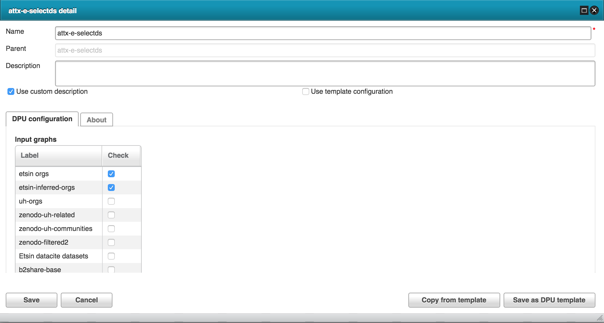

Using construct query to generate new dataset.

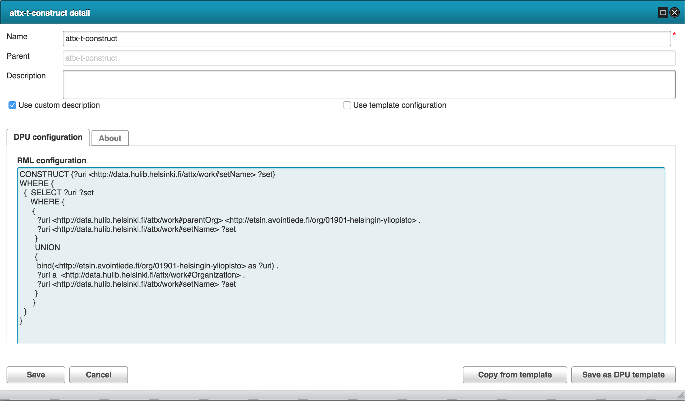

**Publish datasets**

The publishing pipeline transforms internal RDF data into JSON documents.

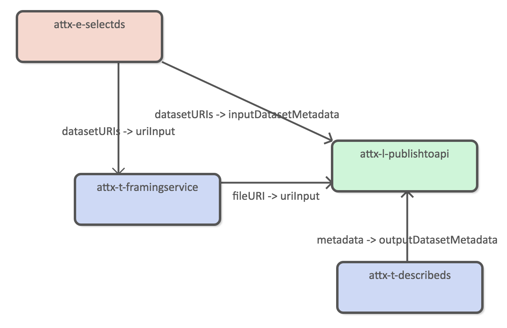

Using the following JSON-LD frame.

```json
{
  "@context": {
    "dc": "http://purl.org/dc/elements/1.1/",
    "ex": "http://example.org/vocab#",
    "work": "http://data.hulib.helsinki.fi/attx/work#",
    "version": "work:version",
    "identifier": "work:identifier",
    "idenfifierValue": "work:value",
    "identifierType": "work:type",
    "title": "work:title",
    "subjects": "work:subject",
    "subject": "work:term",
    "creators": "work:creator",
    "creatorName": "work:creatorName",
    "contributors": "work:contributor",
        "contributorName": "work:contributorName",
    "contributorType": "work:contributorType",

    "affiliation" : "work:affiliation",
    "publisher": "work:publisher",
    "publicationYear": "work:pubdate",
    "language": "work:language",
    "resourceType": "work:resourceType",
    "resourceTypeGeneral": "work:title",
        "nameIdentifiers": "work:nameIdentifier",
    "subjectScheme": "work:subjectScheme",
    "valueURI": "work:valueURI",
    "rightsList": "work:license",
    "rights": "work:licenseID"

  },
  "@type": "work:uh-dataset",
  "@explicit": true,
  "@requireAll": false,
  "identifier": {
    "@type": "work:ID",
          "@explicit": true,
    "idenfifierValue": "",
    "identifierType": ""
  },
  "title": "",
  "subjects": {
    "subject": "",
    "subjectScheme": "",
    "valueURI": ""
  },
  "creators": {
    "@explicit": true,
    "@requireAll": false,
    "creatorName": "",
    "affiliation": "",
    "nameIdentifiers": {

      "@explicit": true,
      "idenfifierValue": "",
      "identifierType": ""
    }
  },
  "contributors": {
    "@explicit": true,
    "@requireAll": false,
    "contributorName": "",
    "contributorType": "",
    "affiliation": "",
    "nameIdentifiers": {

      "@explicit": true,
      "idenfifierValue": "",
      "identifierType": ""
    }
  },
  "publisher": "",
  "publicationYear": "",
  "language": "",
  "resourceType": {
    "@explicit": true,
    "resourceTypeGeneral": ""
  },
  "rightsList": {
    "@explicit": true,
    "rights" : "",
    "rightURI": ""
  },
  "version": {"@default": "4.0"}
}
```

### Internal datasets

Internal storage consists of datasets that work as input and output processing and publication pipelines.
Figure below depicts a simplified versions of data structures inside each dataset. For example in the B2Share case, the first dataset "UH(?) datasets" includes dataset metadata for all the datasets that could be UH related since it has been generated from a query that return every dataset that contains "helsin" in their metadata. The second, the filtered datasets, only adds new type (or tag if you will) to the datasets that are identified as proper UH datasets. The last JSON dataset represent the published search index that contains JSON representation for each of the datasets. 

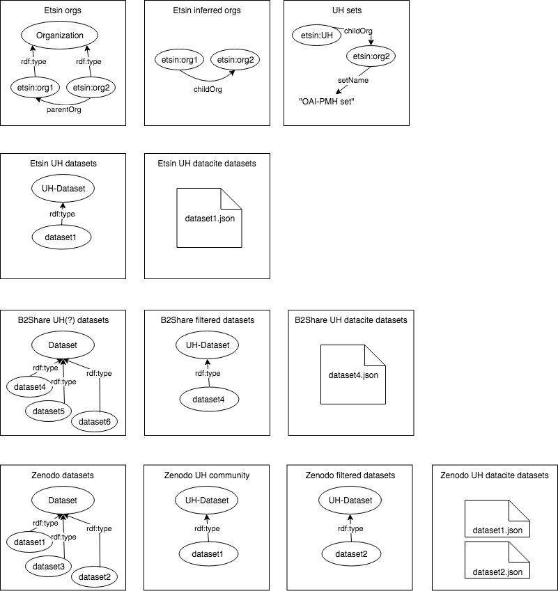
