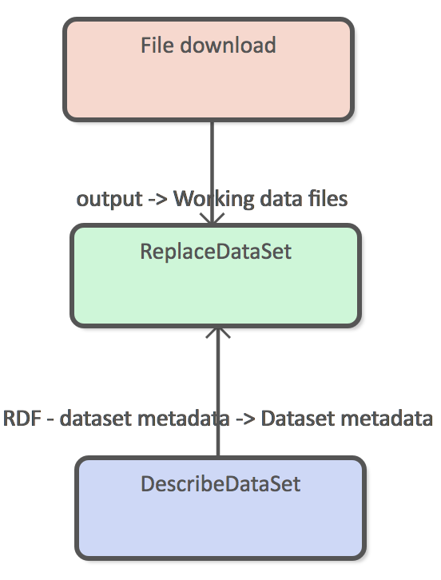
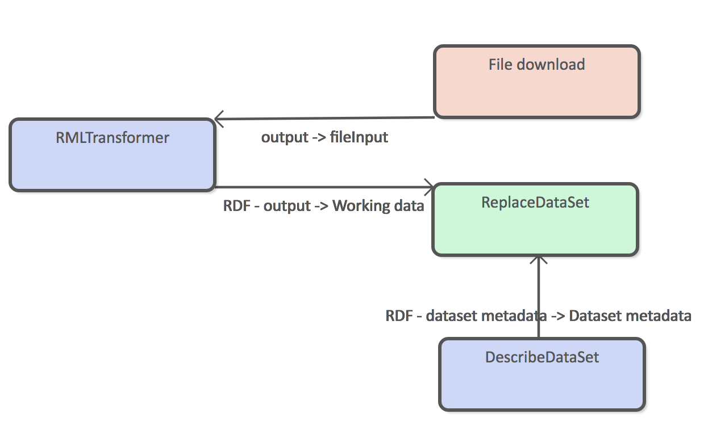
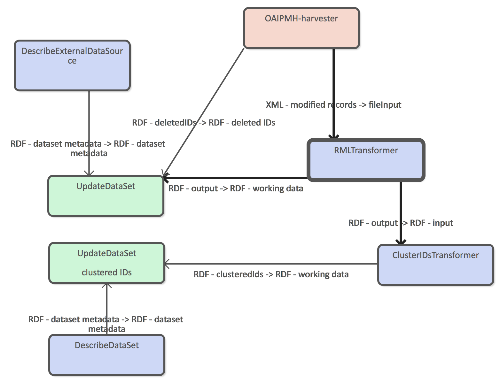
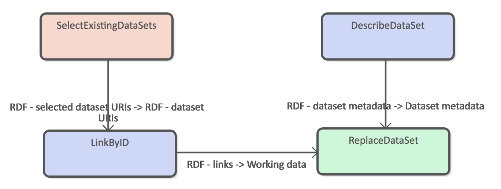
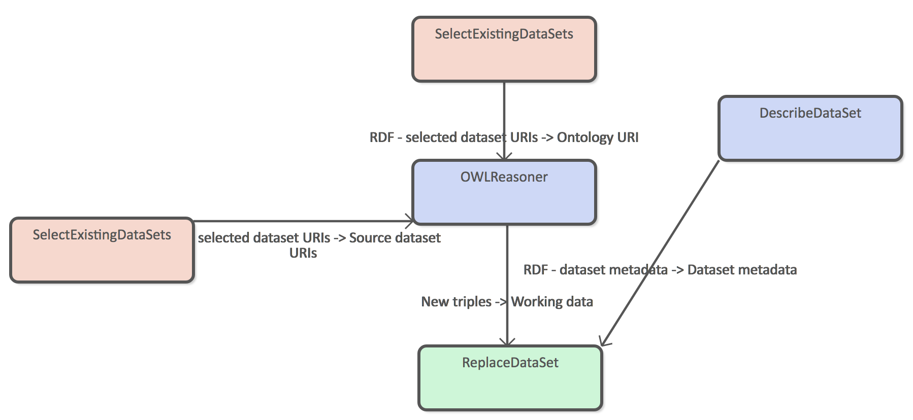
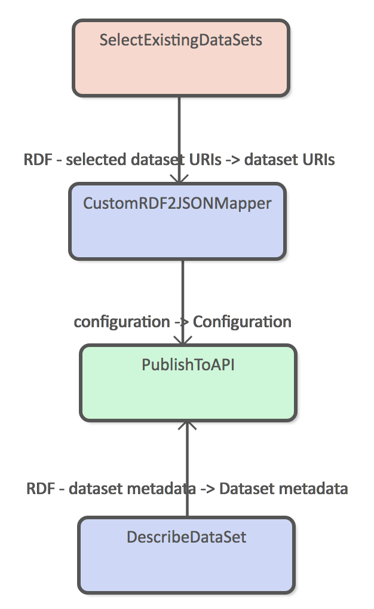

# ATTX Semantic Broker - Data Administrator's User guide

## Introduction

This user guide is for people who have an _ATTX Semantic Broker_ platform instance up and running and want to start working with data. ATTX uses [UnifiedViews ETL tool](https://unifiedviews.eu/) as the tool to define, execute, monitor, debug, schedule data related processes. In UnifiedViews these processes are defined as pipelines, which consists of steps that are implemented using DPUs (Data Processing Unit).

The traditional way of using ETL tools is to create potentially complex pipelines that Extract data from one or more data sources, run multiple Transformations and finally Load the data to another system. In these scenarios, ETL tool sits in the middle, handling data flows from A to B. In ATTX Semantic Broker, ETL is part of the system itself and the system can use itself as the data source. From the ETL point of view, it is a opinionated framework for building pipelines.

ATTX Semantic Broker has three types of pipelines: Ingestion, Processing and Distribution. Each type has its own characteristics, but the main ideas are as follows:

* **Ingestion pipelines** are the only ones that work with external data;
* **Processing pipelines** only work with internal data;
* **Distribution pipelines** are the only ones that are used to expose/distribute/publish data to the public.

### Table of Contents
<!-- TOC START min:1 max:3 link:true update:true -->
- [ATTX Semantic Broker - Data Administrator's User guide](#attx-semantic-broker---data-administrators-user-guide)
  - [Introduction](#introduction)
    - [Table of Contents](#table-of-contents)
  - [Pipeline Types](#pipeline-types)
    - [Ingestion Pipelines](#ingestion-pipelines)
    - [Processing Pipelines](#processing-pipelines)
    - [Distribution Pipelines](#distribution-pipelines)
  - [ATTX DPUs](#attx-dpus)
    - [Extractors](#extractors)
    - [Transformers](#transformers)
    - [Loaders](#loaders)
  - [Semantic Broker End to End Usage Scenario](#semantic-broker-end-to-end-usage-scenario)

<!-- TOC END -->


## Pipeline Types

Every pipeline essentially represents one or more datasets.

### Ingestion Pipelines


**Simple download and replace**

The simplest ingestion pipeline consists of three DPUs as depicted in figure X. In this example the downloaded data is already in RDF format and requires no transformations. Replace dataset loader means that old version of the data are always completely replaces with the new version.




This kind of pipelines can be used to download ontologies or vocabularies to the Semantic Broker.

**Download and transform**

It more common that the source data is not in RDF format or that the structure of the data is not exactly what you want store internally. Figure X shows an example where `RMLTransformer` is used to transform from example CSV file into RDF before adding in to the Semantic Broker's data storage.



Both replace and update data set DPUs require RDF input, so transformation step is required for all input data that is not available in RDF format.


**Incremental harvesting**

OAI-PMH harvesting interface allows one to harvest new records incrementally based on the timestamp they were last modified. Incremental harvesting requires `UpdateDataSet` DPU to be used, or otherwise the target dataset will only contain the latest changes.



Example workflow has two Loader DPUs, because we want to store clustered ids in to a separate dataset so that we can update the clustering configuration more easily.


### Processing Pipelines

**Link by ID**

This example uses clustered ids and harvested datasets as the source data and generated new explicit links between resource. For example:

Clustered ids:
```turtle
:pub1
  attx:id "urn:1"

:org1
  attx:id "orgID1"

```

working data 1
```turtle
:pub1
  a Publication
  urn "urn:1"
  org "orgID1"
```

linkByID data set
```turtle
:pub1
  orgLink :org1
```



**Simple reasoning**

`OWNReasoner` can be configured to use either pipeline specific ontology or ontology data set as it's configuration. This example shows an example of the latter case. `SelectExistingDataSets` DPU connected to the Ontology URI port is the data set that contains ontology triples where as the other `SelectExistingDataSets` DPU refers to the data set that contain triples that will the target of the reasoning process.



### Distribution Pipelines

Basic distribution pipeline example that select all the required source data and uses the custom RDF to JSON mapper to transform graph into documents. Resulting documents are added to the REST API using `PublishToAPI` DPU.



## ATTX DPUs

ATTX Semantic Broker ships with custom [UnifiedViews](https://github.com/UnifiedViews) DPUs that must be used when designing pipelines. DPUs have been categorized into extract, transform/generate and load classes and in most cases every pipeline contains at least one DPU from each category.

### Extractors

ATTX extractor DPU are used to configure ingestion of external data source to the Semantic Broker or selection of existing data source(s) for processing or dissemination.

#### File Download

This DPU simply downloads and stores file from the given URL and passes it on to further processing. It can be used update dataset that are based on for example CSV exports.

Configuration:
- URL *
- username
- password
- method
- payload
- ignore SSL errors
- timeout

Output:
- files

#### OAI-PMH Harvester

This is a more complicated downloader that works with data sources that comply with [OAI-PMH 2.0 metadata harvesting protocol](http://www.openarchives.org/OAI/openarchivesprotocol.html). This harvester can be used for selective and incremental harvesting via set and from and until parameters. Set defines a named set of records i.e. "Openly_available_theses" for harvesting. From and until are `YYYY-MM-DD` (date) formatted string that can be used to filter harvested records based on their timestamps. Another way to filter records by times-tamp is to harvest only records that were added/modified/deleted since the previous successful execution of the pipeline.

If the data source supports tracking of deleted records, those are outputted as a separate set of OAI-PMH identifiers.

Configuration:
- base URL *
- metadata format *
- set
- Filter by date (bool)
  - from date
  - until date
  - since previous successful harvesting

Output:
- deleted ids
  - OAI-PMH identifiers of deleted records.
- modified records  

#### Select Existing Datasets

This DPU provides search interface to the existing dataset metadata and allows users to reuse their content as the data source for pipelines. This DPU must be used as a loader for both processing and distribution pipelines.

Configuration/Output:
- Selected dataset URIs

### Transformers

ATTX transformers create new data. New data can be metadata about the datasets or data that is generated through some type of processing, such as linking, reasoning or any kind of transformation.  

#### Describe External Data Source

This DPU is used to input simple metadata about the data source that is being used as the basis of internal data set. The main difference between internal data set and external data source, is that latter **must** contain some type of indication of license. Same licensing information is then attached to any derived dataset from this data source. In the case two external datasets are used in the Processing pipeline with distinct licenses, the license associated with the derived dataset will be the most restrictive.

Configuration:
- Name *
- Description
- License *

Output:
- Data source metadata

#### Describe Data Set

Provides simple metadata for the internal dataset, which is used for example by the "Selected existing datasets" DPU.

Configuration:
- Name *
- Description

Output:
- Data set metadata

#### Cluster IDs

This DPU generates triples that cluster all the different resource identifier under one common property.

When used as part of a ingest pipeline, one must use the RDF input connector. This provides the currently ingested RDF as the source for clustering.

This DPU can also be used as part of a processing pipeline when paired with "Select existing data sets" DPU. This way the source data is the full content of one or more working graphs.

*How about a case where data about the same Thing is coming in from two different sources?*

Configuration:
- list of properties to use for clustering as URIs

Output:
- Clustered IDs RDF

Example:

Configuration:
- dc:identifier, custom:urn

Input
```turtle
<attx:ds/1/work/infra/1>
  <dc:identifier> "infra/1" ;
  <custom:urn> <urn:2> .

```

Output:
```turtle
<attx:ds/1/work/infra/1>
  <attx:id> "infra/1" ;
  <attx:id> <urn:2> .

```

#### RML Transformer

Uses RML processor to transform CSV, XML and JSON files to RDF.

Configuration:
- RML configuration

Output:
- RDF


#### Link by ID

Creates new explicit links from identifiers using the clustered IDs information.

Configuration:
- Source type
- Source property
- Target property

Output:
- RDF

Example:

working data 1
```turtle
:pub1
  a Publication
  urn "urn:1"
  org "orgID1"

:org1
  extID "orgID1"
```

ids graph
```turtle
:pub1
  attx:id "urn:1"

:org1
  attx:id "orgID1"

```

Configuration
- source type: Publication
- source property: org
- target property: orgLink

New data

```turtle
:pub1
  orgLink :org1
```

#### Custom RDF to JSON Mapper

Uses custom configuration file to traverse and transform RDF to nested JSON documents.

**TODO:
Add more detailed description of mapping file.**

RDF to JSON mapper can only work on existing data sets and cannot therefore be part of a ingestion pipeline.

Input:
- dataset URIs

Output:
- Custom mapping configuration


#### JSON-LD Framing Based RDF to JSON Mapper

Uses [JSON-LD framing](http://json-ld.org/spec/latest/json-ld-framing/) to create deterministic serialization of a graph to JSON document.

RDF to JSON mapper can only work on existing data sets and cannot therefore be part of a ingestion pipeline.

Input:
- dataset URIs

Output:
- Framing configuration


### Loaders

ATTX Loaders are components handle generated data by either storing it internally or handing it over to a distribution component for public consumption. Loader DPUs only have inputs.

#### Replace Data Set

DPU that replaces all the old content with new data. This DPU should be used, when the source data is from a data dump.

Input data can be configured to be RDF passed down from previous DPUs or file generated by some other DPU.

Inputs:
- Data set metadata
- New data
- New data files

#### Update Data Set

Update DPU uses input data to create a SPARQL update request, which will preserve any existing data that is not part of the update. It also handles situations where value of a certain property has changed without creating duplicate property values. For example:

Old data:
```turtle
<subject> <dct:title> "Test"
```

SPARQL update:
```sparql
DELETE { <subject> <dct:title> "Test" }
INSERT { <subject> <dct:title> "Testing" }
```

New data:

```turtle
<subject> <dct:title> "Testing"
```

Inputs
- Data set metadata
- Deleted IDs
- Updated data


Target graph is generated based on the contextual information.

#### Publish to API

This DPU can be used to distributed generated JSON documents through a REST API.

Input:
- dataset metadata
- configuration

#### Publish to File

This DPU copies file to a web server with given path and file name.

Configuration:
- path
- File name

## Semantic Broker End to End Usage Scenario

This section provides a end to end example that uses ATTX Semantic Broker platform from harvest, to linking and distributing the data maintained by three different sources.

Data sources are:
- Helda publication data  
- Finto vocabularies
- HY organization registry

A first step consists of linking publication metadata with Finto vocabularies and organizational units using subject and contributor field respectively. In the following step it will use simple OWL reasoning on SKOS vocabulary to add links from linked subject's parent concepts to the publication. This allows users for example to search for "Beverage" and find things described as "Tea". Finally, the distribution pipeline will add multilingual labels for the linked subjects.

Example of result document:
```json
{
  "title": "Testing",  
  "org": {
    "name": "Helsinki University Library",
    "orgUnitCode": "Test"
  },
  "subjects": [
    {
      "id": "http://www.yso.fi/onto/yso/p5127",
      "label": {
        "fi": "juomat",
        "en": "beverages",
        "sv": "drycker"
      }
    }
  ]
}
```


*To be continued...*
